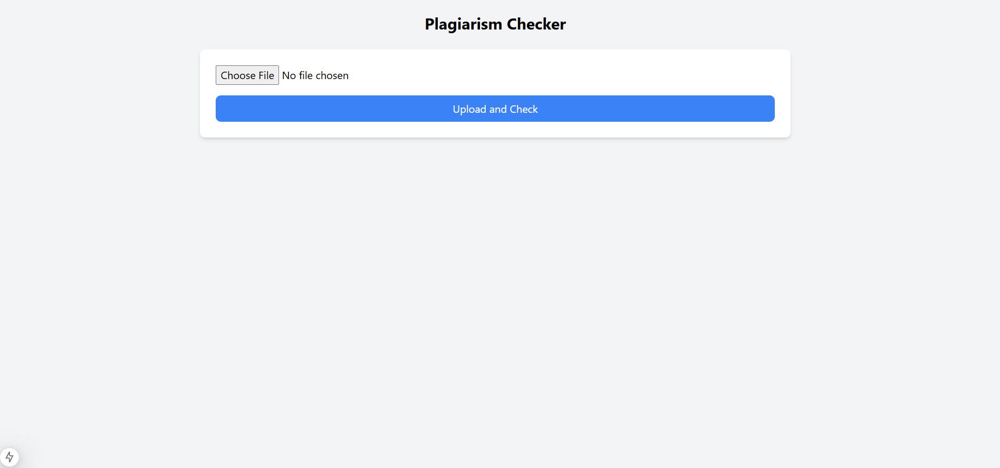
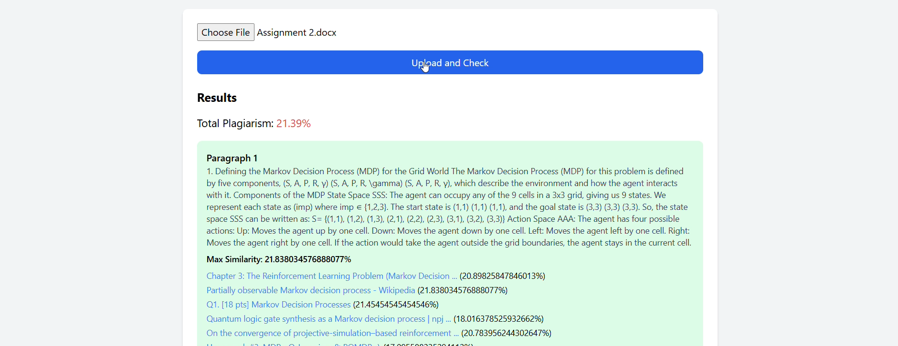

# Plagiarism Detection Project

### File Upload Page


### Results Page



This project is a plagiarism detection application built using:

- **Backend**: FastAPI (Python)
- **Frontend**: Next.js (React)

## Features

- File upload and text extraction
- Google API integration for similarity detection
- Dynamic UI with results highlighting

---

## Prerequisites

### Google API usage

Here’s how you can add this information to the **README.md** file:

---


#### **Google API Usage and Quota Information**

This project uses the **Google Custom Search JSON API** to detect plagiarism by querying content for similarity.

1. **Free Quota Limit**:
   - The Google API offers a **free quota of 100 queries per day**.
   - If you exceed this limit, you will encounter a `429 Client Error: Too Many Requests`.
   - Daily quotas reset at **midnight Pacific Time (PT)**.

2. **Exceeding the Free Quota**:
   - Additional queries are billed at **$5 per 1,000 requests**, up to a maximum of **10,000 requests per day**.
   - If you need more than **10,000 queries per day**, consider using the **Custom Search Site Restricted JSON API**, which removes daily limits for specific use cases.

3. **Recommendations**:
   - Monitor your usage in the **Google Cloud Console** under `APIs & Services > Usage`.
   - To prevent exceeding the limit during testing or production, consider:
     - Upgrading to a paid plan by enabling billing in your Google API project.
     - Optimizing API calls to reduce unnecessary queries.

For more details on Google API limits and pricing, refer to [Google's official documentation](https://developers.google.com/custom-search/v1/introduction).


### Backend

1. **Install Python 3.10 or Later**  
   Download and install Python from the [official Python website](https://www.python.org/downloads/).

2. **Install Required Dependencies**  
   Run the following command in the `backend` folder:
   ```bash
   pip install -r requirements.txt
   ```

3. **Set Up Google API Keys**  
   This project uses the **Google Custom Search JSON API** for plagiarism detection. Follow these steps to obtain the required API keys:

   - Go to the [Google Cloud Console](https://console.cloud.google.com/).
   - Create a new project or select an existing one.
   - Enable the **Custom Search JSON API**:
     - Navigate to `APIs & Services > Library`.
     - Search for "Custom Search JSON API" and enable it.
   - Create an API Key:
     - Navigate to `APIs & Services > Credentials`.
     - Click "Create Credentials" and select "API Key."
   - Copy the generated API key.

   Next, set up a custom search engine:
   - Go to the [Programmable Search Engine page](https://programmablesearchengine.google.com/).
   - Click "Create a search engine."
   - Add a placeholder site like `example.com` (this will be overridden by your queries).
   - Copy the **Search Engine ID (cx)** from the **Control Panel**.

   Add these keys to your `.env` file in the `backend` folder:
   ```
   GOOGLE_API_KEY=<your_google_api_key>
   SEARCH_ENGINE_ID=<your_search_engine_id>
   ```

4. **Run the Backend Server**  
   Start the FastAPI server:
   ```bash
   uvicorn app.main:app --reload
   ```

   The backend will run at `http://127.0.0.1:8000`.

---

### Frontend

1. **Install Node.js and npm**  
   Download and install Node.js from the [official Node.js website](https://nodejs.org/).

2. **Install Required Dependencies**  
   Run the following command in the `frontend` folder:
   ```bash
   npm install
   ```

3. **Run the Development Server**  
   Start the Next.js development server:
   ```bash
   npm run dev
   ```

   The frontend will run at `http://localhost:3000`.

---

## Project Structure

- **backend/**: Contains FastAPI code for handling the backend logic.
  - **routers/**: API routes, including the plagiarism detection endpoint.
  - **services/**: Core logic for handling file processing and API integration.
  - **utils/**: Utility functions, like extracting text from uploaded files.
- **frontend/**: Next.js application for the frontend.
  - **app/plagiarism/**: Components for file upload and result display.
  - **public/**: Public assets like images or icons.
- **uploads/**: Temporary file storage for uploaded files (ignored by Git).

---

## Usage

1. Upload a file in `.txt`, `.pdf`, or `.docx` format using the web app.
2. The backend will process the file, query Google Custom Search API, and return the similarity results.
3. View detailed plagiarism results, including similarity scores and links to matched sources.

---

## License

This project is licensed under the MIT License.

---
